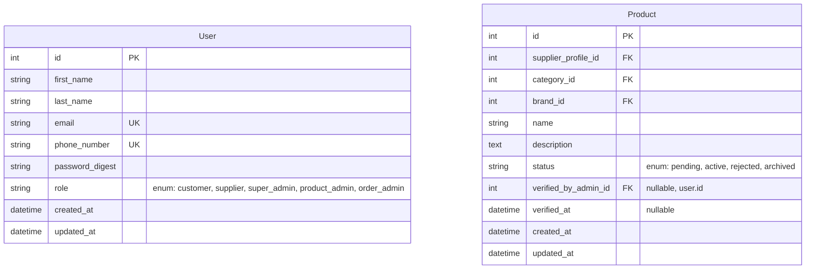

# Development Plan: luxe-threads E-Commerce Platform

This document outlines the complete, sprint-by-sprint development plan for the backend API, the User Frontend, and the Supplier Frontend. The plan is based on our finalized system architecture, which includes a PostgreSQL database, a Rails API, an Elasticsearch search engine, and separate frontend applications.

## I. High-Level Architecture & Schema

### A. System Architecture

```mermaid
graph TD
    subgraph "Clients"
        UserFE["User Frontend (React/Next.js)"]
        SupplierFE["Supplier Frontend (React/Next.js)"]
    end

    subgraph "Backend (Ruby on Rails)"
        API["Rails API (/api/v1)"]
        Admin["Admin Panel (rails_admin + Pundit)"]
        DB["Database (PostgreSQL)"]
        Search["Search Engine (Elasticsearch)"]
        SyncService["Data Sync Service"]
    end

    UserFE -->|Search/Filter Queries| Search
    UserFE -->|Other API Calls| API
    SupplierFE -->|API Calls| API
    
    API -->|CRUD Operations| DB
    Admin -->|Direct Access| DB

    DB -->(Triggers/Callbacks)--> SyncService
    SyncService -->|Updates Denormalized Index| Search
```

### B. Definitive Database Schema (PostgreSQL)

This is the approved, normalized schema that will act as the single source of truth for all application data.



## II. Integrated Sprint Plan

Each sprint is a two-week development cycle.

---

### **Sprint 0: Project Foundation & Setup (Current)**
*   **Goal:** Prepare the development environment and establish project standards.
*   **Backend:**
    *   Initialize Rails application (Complete).
    *   Set up Docker environment (`docker-compose.yml`) for PostgreSQL, Elasticsearch, and Redis.
    *   Configure `Gemfile` with key gems: `devise`, `jwt`, `pundit`, `rails_admin`, `elasticsearch-rails`.
    *   Establish CI/CD pipeline for tests and linting.
    *   Set up API versioning (`/api/v1/`).
*   **Frontend (Both User & Supplier):**
    *   Initialize two separate Next.js applications (`user-frontend`, `supplier-frontend`).
    *   Set up shared component library and theme (e.g., using Storybook).
    *   Establish CI/CD pipelines for both applications.

---

### **Sprint 1: User Authentication & Roles**
*   **Goal:** Implement secure user signup and login.
*   **Backend:**
    *   Create all database models and migrations based on the final schema.
    *   Create `User` model with granular roles.
    *   Implement `/api/v1/signup` and `/api/v1/login` endpoints returning JWTs.
    *   Set up JWT authentication middleware.
*   **User Frontend:**
    *   Create Signup and Login pages.
    *   Implement logic to call signup/login APIs and store JWT securely.
    *   Set up protected routes for authenticated users.
*   **Supplier Frontend:**
    *   Create Signup and Login pages (can reuse components).
    *   Implement JWT authentication flow.

---

### **Sprint 2: Admin Foundation & Supplier Profiles**
*   **Goal:** Set up the admin dashboard and allow suppliers to manage their profiles.
*   **Backend:**
    *   Install and configure `rails_admin`.
    *   Secure admin dashboard using Pundit policies (only `*_admin` roles).
    *   Customize admin dashboard to manage Users, Categories, and Brands.
    *   Implement `/api/v1/supplier/profile` endpoints (CRUD for `SupplierProfile`).
*   **Supplier Frontend:**
    *   Create a "My Profile" page.
    *   Build a form to allow suppliers to view and update their `SupplierProfile` information.

---

### **Sprint 3: Product & Variant Management**
*   **Goal:** Enable suppliers to create and manage their products.
*   **Backend:**
    *   Implement API endpoints for suppliers to perform CRUD operations on their `Products` and `ProductVariants`.
    *   Implement API endpoints to fetch `Categories`, `Brands`, and `AttributeTypes`/`Values` to populate forms.
    *   Set up ActiveStorage for `ProductImage` uploads.
*   **Supplier Frontend:**
    *   Create a "My Products" page to list a supplier's products.
    *   Build a multi-step form for creating/editing a `Product`:
        *   Step 1: Basic details (name, category, brand).
        *   Step 2: Add `ProductVariants` (SKU, price, stock).
        *   Step 3: Assign attributes (color, size) to variants.
        *   Step 4: Upload images for each variant.

---

### **Sprint 4: Product Discovery & Search**
*   **Goal:** Allow customers to find products.
*   **Backend:**
    *   Set up the `Data Sync Service` to populate the Elasticsearch index whenever a product is created/updated.
    *   Implement `/api/v1/products/search` endpoint that queries Elasticsearch. This API must support filtering by category, brand, attributes, and price range, and return facets.
    *   Implement `/api/v1/products/:id` endpoint to get detailed info for a single product page.
*   **User Frontend:**
    *   Build the Product Listing Page (PLP) with a filter sidebar.
    *   Implement logic to call the search API and display products.
    *   Update the filter sidebar dynamically based on the API's facet response.
    *   Build the Product Detail Page (PDP) to display all product variant info, images, etc.

---

### **Sprint 5: Admin Verification & Cart**
*   **Goal:** Admins can verify products, and users can add items to their cart.
*   **Backend:**
    *   Enhance `rails_admin` for `product_admins` to view pending products and approve/reject them.
    *   Implement `Cart` and `CartItem` models and associated APIs (`/api/v1/cart`).
*   **User Frontend:**
    *   On the PDP, add an "Add to Cart" button.
    *   Create a Cart page/drawer to show items, update quantities, and show totals.
*   **Admin UI:**
    *   Ensure the product verification workflow is intuitive for admins.

---

### **Sprint 6: Checkout & Order Placement**
*   **Goal:** Allow customers to place orders.
*   **Backend:**
    *   Implement `Order`, `OrderItem`, and `Address` models and APIs.
    *   Create `/api/v1/orders/checkout` endpoint to create an order from the cart, handle inventory reduction.
    *   Implement `/api/v1/addresses` API for users to manage their address book.
*   **User Frontend:**
    *   Build a multi-step checkout flow:
        *   Step 1: Select shipping address (or add a new one).
        *   Step 2: Review order and proceed to payment.
        *   Step 3: "Thank You" / Order Confirmation page.

---

### **Sprint 7: Payments & Order Management**
*   **Goal:** Process payments and allow users/suppliers to view orders.
*   **Backend:**
    *   Integrate with a payment gateway (e.g., Stripe).
    *   Implement payment processing and webhooks to update order status.
    *   Implement `/api/v1/my-orders` endpoint for customers.
    *   Implement `/api/v1/supplier/orders` endpoint for suppliers.
*   **User Frontend:**
    *   Create a "My Orders" page to view order history and status.
*   **Supplier Frontend:**
    *   Create an "Orders" page for suppliers to see and manage incoming orders for their products.

---

### **Sprint 8: Reviews & Returns**
*   **Goal:** Implement product reviews and the full returns lifecycle.
*   **Backend:**
    *   Implement `Review` model and APIs. Only allow reviews for purchased products.
    *   Implement `ReturnRequest`, `ReturnItem`, `ReturnMedia` models and the full API flow for initiating and managing returns.
    *   Enhance admin dashboard to manage returns.
*   **User Frontend:**
    *   On the "My Orders" page, add a button to "Write a Review" and "Request Return".
    *   Build the review submission form.
    *   Build the return request form, including reason and image/video upload.
*   **Supplier Frontend:**
    *   Add a "Returns" section for suppliers to see and manage return requests for their items.