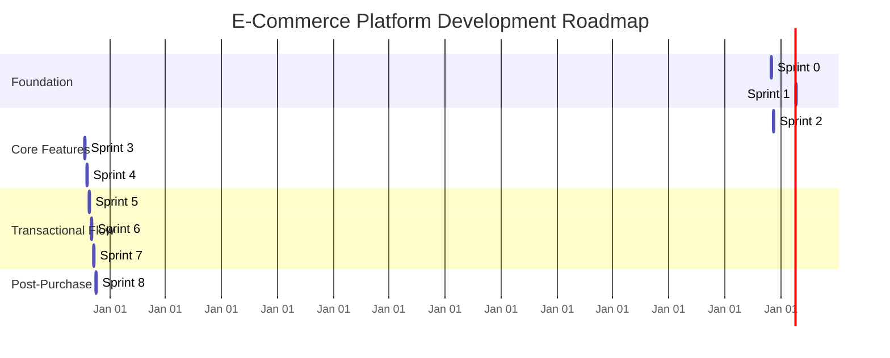

# Project Execution Plan: E-Commerce Platform

This document provides a comprehensive, strategic guide for building the entire e-commerce application. It synthesizes the existing planning documents into an actionable, sprint-based plan for both frontend and backend development.

---

## 1. Overall Approach & Technical Strategy

Our approach is to build the platform iteratively, focusing on delivering complete vertical slices of functionality in each sprint. The architecture is based on a robust, decoupled system:

*   **Backend:** A Ruby on Rails API serving all business logic and data.
*   **Database:** PostgreSQL as the single source of truth for all data.
*   **Search:** Elasticsearch for powerful and fast product discovery, filtering, and faceting.
*   **User Frontend:** A Next.js application dedicated to the customer experience.
*   **Supplier Frontend:** A separate Next.js application for suppliers to manage their products and orders.

The development will be **API-first**. The backend team will implement the endpoints defined in the `API_SPECIFICATION.md`, which will then be consumed by the two frontend applications as mapped out in `FRONTEND_API_MAP.md`.

---

## 2. Visualized Sprint Roadmap

This timeline shows the progression of features over the planned sprints.

---

## 3. Detailed Sprint-by-Sprint Plan

Each sprint is a two-week development cycle.

### **Sprint 0: Project Foundation & Setup**
*   **Goal:** Prepare the development environment and establish project standards.
*   **Backend:**
    *   Initialize Rails app, set up Docker (PostgreSQL, Elasticsearch, Redis).
    *   Configure `Gemfile` (`devise`, `jwt`, `pundit`, etc.).
    *   Establish CI/CD pipeline and API versioning (`/api/v1/`).
*   **Frontend (Both User & Supplier):**
    *   Initialize two separate Next.js applications (`user-frontend`, `supplier-frontend`).
    *   Set up a shared component library and theme.
    *   Establish CI/CD pipelines.

### **Sprint 1: User Authentication & Roles**
*   **Goal:** Implement secure user signup and login for both customers and suppliers.
*   **Backend:**
    *   Create all database models and migrations from the schema.
    *   Implement `User` model with roles (`customer`, `supplier`, `admin`, etc.).
    *   Build `/api/v1/signup` and `/api/v1/login` endpoints that return JWTs.
    *   Set up JWT authentication middleware.
*   **User Frontend:**
    *   Create Signup and Login pages.
    *   Implement logic to call APIs and store JWT securely.
    *   Set up protected routes.
*   **Supplier Frontend:**
    *   Create Signup and Login pages.
    *   Implement JWT authentication flow.

### **Sprint 2: Admin Foundation & Supplier Profiles**
*   **Goal:** Set up the admin dashboard and allow suppliers to manage their profiles.
*   **Backend:**
    *   Install and configure `rails_admin`, secured with Pundit policies.
    *   Enable management of Users, Categories, and Brands from the admin panel.
    *   Implement `/api/v1/supplier/profile` CRUD endpoints.
*   **Supplier Frontend:**
    *   Create a "My Profile" page with a form to view/update supplier information.

### **Sprint 3: Product & Variant Management**
*   **Goal:** Enable suppliers to create and manage their products.
*   **Backend:**
    *   Implement CRUD APIs for `Products` and `ProductVariants`.
    *   Implement APIs to fetch `Categories`, `Brands`, and attributes for forms.
    *   Set up ActiveStorage for `ProductImage` uploads.
*   **Supplier Frontend:**
    *   Create a "My Products" page to list a supplier's products.
    *   Build a multi-step form for creating/editing products and their variants, including attribute assignment and image uploads.

### **Sprint 4: Product Discovery & Search**
*   **Goal:** Allow customers to find products via search and filtering.
*   **Backend:**
    *   Create the service to sync product data from PostgreSQL to Elasticsearch.
    *   Implement `/api/v1/products/search` endpoint that queries Elasticsearch and supports filtering, faceting, and pagination.
    *   Implement `/api/v1/products/:id` to get full product details.
*   **User Frontend:**
    *   Build the Product Listing Page (PLP) with a filter sidebar.
    *   Implement logic to display search results and dynamically update filters based on API response facets.
    *   Build the Product Detail Page (PDP).

### **Sprint 5: Admin Verification & Cart**
*   **Goal:** Allow admins to verify products and users to manage their shopping cart.
*   **Backend:**
    *   Enhance `rails_admin` for `product_admins` to approve/reject pending products.
    *   Implement `/api/v1/cart` endpoints (CRUD for `CartItem`).
*   **User Frontend:**
    *   Add an "Add to Cart" button on the PDP.
    *   Create a Cart page/drawer to show items, update quantities, and display totals.

### **Sprint 6: Checkout & Order Placement**
*   **Goal:** Enable customers to complete the checkout process and place orders.
*   **Backend:**
    *   Implement `/api/v1/orders/checkout` endpoint to create an `Order` from the cart and handle inventory reduction.
    *   Implement `/api/v1/addresses` API for users to manage their address book.
*   **User Frontend:**
    *   Build a multi-step checkout flow (Shipping Address -> Review -> Confirmation).
    *   Create an "Order Confirmation" page.

### **Sprint 7: Payments & Order Management**
*   **Goal:** Process payments and allow users/suppliers to view and manage orders.
*   **Backend:**
    *   Integrate with a payment gateway (e.g., Stripe), including webhooks to update order status.
    *   Implement `/api/v1/my-orders` for customers.
    *   Implement `/api/v1/supplier/orders` for suppliers.
*   **User Frontend:**
    *   Create a "My Orders" page to view order history and status.
*   **Supplier Frontend:**
    *   Create an "Orders" page for suppliers to view and manage their incoming orders.

### **Sprint 8: Reviews & Returns**
*   **Goal:** Implement the post-purchase experiences of writing reviews and requesting returns.
*   **Backend:**
    *   Implement `Review` APIs (only for purchased products).
    *   Implement APIs for the full `ReturnRequest` lifecycle.
    *   Enhance `rails_admin` to manage returns.
*   **User Frontend:**
    *   Add "Write a Review" and "Request Return" buttons on the "My Orders" page.
    *   Build forms for submitting reviews and return requests (including media upload).
*   **Supplier Frontend:**
    *   Add a "Returns" section for suppliers to manage return requests for their items.

---

## 4. How to Get Started: Recommended First Steps

1.  **Execute Sprint 0:** Focus all initial effort on setting up the environments as described. A solid foundation is critical. Ensure Docker, Rails, and the two Next.js apps are running smoothly and that CI/CD pipelines are active.
2.  **Begin Sprint 1 (Backend):** Immediately start creating the database models and migrations. While the frontend team works on auth pages, the backend team must deliver the `signup` and `login` endpoints. This is the most critical dependency for both frontend applications.
3.  **Begin Sprint 1 (Frontend):** Concurrently, the frontend teams can build the static UI for the Login and Signup pages. They can use mock API responses until the actual backend endpoints are live.
4.  **Review & Iterate:** At the end of each sprint, review the progress against the plan and adjust the next sprint's priorities as needed.